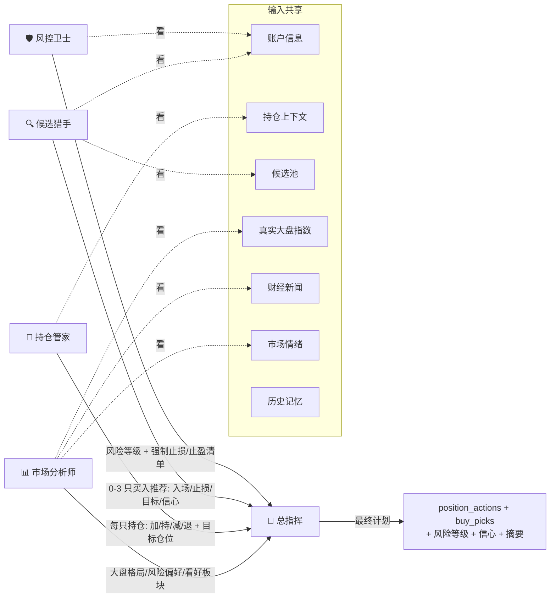

# A股模拟短线交易训练器 — AI 决策流程图

> 基于当前 `web_app.py` 业务逻辑绘制（截至 2026-07-14）。
> 决策主链路：`TradingEngine._comprehensive_trade` → `run_agent_cycle_with_fallback` → `run_trading_agent_cycle`（LangGraph 编排 6 个 Agent 节点）。

## 一、全局主流程

```mermaid
flowchart TD
    Start([交易周期触发]) --> RealCheck{真实交易时段?}

    RealCheck -->|否 FORCE_TRADING=1 除外| RecordOnly[仅记录决策 不真实下单]
    RealCheck -->|是| HardRisk

    HardRisk[① 硬风控前置<br/>止损/止盈线 不依赖AI] --> HRA
    HRA{触发硬止损/止盈?}
    HRA -->|盈利保护: 止损上移至成本线| HRexec[强制卖出 exec_sell]
    HRA -->|T+1 限制无可卖量| HRblock[标记风险锁定 暂不开仓]
    HRA -->|未触发| Ctx1[刷新账户现金]

    HRexec --> Ctx1
    HRblock --> Ctx1

    Ctx1[② 持仓上下文<br/>实时价/盈亏%/持有天数/止损/近K线] --> Cand
    Cand[③ 候选池精筛<br/>全市场按成交额Top150<br/>剔除涨幅>6% 与 强下跌趋势<br/>+ 技术面/基本面指标] --> Indices

    Indices[④ 大盘环境获取<br/>真实指数(沪/深/创业板/沪深300)<br/>+ 财经新闻(政策/行业面)] --> Sent
    Sent[⑤ 市场情绪<br/>涨跌家数比 → 情绪分数] --> Acct

    Acct[⑥ 账户信息<br/>可用现金/最大持仓/剩余名额] --> BuildCtx[构建 Agent 上下文]

    BuildCtx --> AgentCycle
    RecordOnly -.-> AgentCycle

    subgraph AgentCycle[多 Agent 决策流水线]
        direction TB
        M0[recall_memory<br/>召回近期记忆] --> M1
        M1[analyze_market 📊<br/>市场分析师] --> M2
        M2[review_positions 💼<br/>持仓管家] --> M3
        M3[research_candidates 🔍<br/>候选猎手] --> M4
        M4[risk_review 🛡️<br/>风控卫士] --> M5
        M5[synthesize_decision 🎯<br/>总指挥]
    end

    M5 --> PlanOK{计划校验<br/>validate_final_trading_plan}
    PlanOK -->|异常| Safe[安全计划: 维持现状<br/>risk_level=high]
    PlanOK -->|正常| ExecPos

    ExecPos[⑦ 执行持仓动作<br/>加/持/减/退] --> EPact{动作类型}
    EPact -->|hold| Hold[记录持有]
    EPact -->|exit/reduce| SellAct[exec_sell 卖出]
    EPact -->|add| BuyAdd[exec_buy 加仓]

    SellAct --> BuyNew
    BuyAdd --> BuyNew
    Hold --> BuyNew

    BuyNew[⑧ 执行新开仓<br/>遍历 buy_picks] --> BNcheck{过滤检查}
    BNcheck -->|已持仓/刚卖出| Skip1[跳过]
    BNcheck -->|名额已满/达日限额| Skip2[停止开仓]
    BNcheck -->|信心不足/追高/尾盘| Skip3[should_skip_buy_pick]
    BNcheck -->|通过| DoBuy[exec_buy 买入]

    Skip1 --> End
    Skip2 --> End
    Skip3 --> End
    DoBuy --> End
    Safe --> End
    End([周期结束 写日志/记忆])
```

## 二、6 个 Agent 节点的输入与输出



## 三、硬规则（不靠 AI，强制生效）

| 规则 | 代码位置 | 说明 |
|------|---------|------|
| T+1 限制 | `calc_available_to_sell` | 当日买入不可卖出 |
| 硬止损线 | `should_force_exit(pnl, stop_loss_pct)` | 亏损达阈值强制卖出 |
| 盈利保护 | `profit_protect_pct` | 盈利达标后止损上移至成本线 |
| 单票仓位上限 | `cap_target_pct` / `max_position_pct` | 加仓目标仓位封顶 |
| 最低现金保留 | `min_cash_reserve` | 限制最大可买金额 |
| 追高拦截 | `should_skip_buy_pick` | 低信心 / 涨幅过高 / 尾盘不买 |
| 每日买入限额 | `max_buy_per_day` | 单日累计买入上限 |

## 四、关键说明

1. **硬风控先于 AI**：止损/止盈在 AI 决策前强制执行，AI 看不到、也改不了已触发的风控单。
2. **AI 决策是"建议"**：最终由 `exec_sell` / `exec_buy` 在通过全部硬规则（名额、金额、追高拦截）后才真正成交；非交易时段或 `FORCE_TRADING` 未开启时仅记录不下单。
3. **新增维度**：真实大盘指数（东方财富优先、新浪兜底）与财经新闻已从本轮起接入「市场分析师」节点，弥补此前"只盯个股技术面"的盲点。
```
